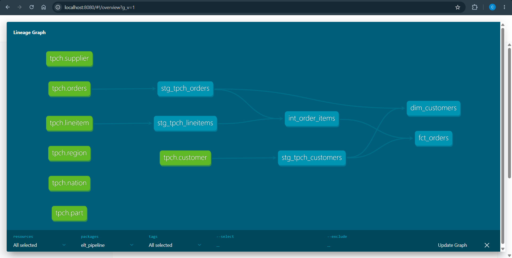

# ELT Pipeline — Airflow · dbt · Snowflake
### Modern data stack portfolio project | TPC-H dataset | 1.5M orders · 6M line items

> End-to-end ELT pipeline: Snowflake as the data warehouse, dbt for SQL transformations with tests and docs, Apache Airflow (via Astronomer Cosmos) for orchestration, and GitHub Actions for CI/CD. All running locally with Docker — no paid services required beyond a free Snowflake trial.

[](https://getdbt.com)
[](https://airflow.apache.org)
[](https://snowflake.com)
[](https://github.com/features/actions)

---

## What this project demonstrates

| Skill | Tool | What you built |
|-------|------|----------------|
| Data warehousing | Snowflake | Database, schemas, warehouse, role, user — production-style setup |
| ELT architecture | dbt + Snowflake | 3-layer transformation: staging → intermediate → marts |
| Data modelling | dbt | Fact table (`fct_orders`), dimension table (`dim_customers`) |
| Data testing | dbt tests | Uniqueness, not_null, relationships, accepted values, range checks |
| Data documentation | dbt docs | Auto-generated lineage graph and column descriptions |
| Orchestration | Apache Airflow | DAG with daily schedule, retries, task-level visibility |
| dbt + Airflow integration | Astronomer Cosmos | Each dbt model becomes an Airflow task automatically |
| CI/CD | GitHub Actions | dbt compile + test on every pull request |
| Security | env vars + .gitignore | Credentials never committed to git |

---

## Architecture

```
Snowflake Sample Data (TPC-H)
         │
         │  Source tables:
         │  orders (1.5M), lineitem (6M),
         │  customer (150K), nation, region
         ▼
┌─────────────────────────────────────────────────────┐
│                  Snowflake: elt_db                  │
│                                                     │
│  ┌──────────┐  ┌──────────────┐  ┌──────────────┐  │
│  │ staging  │→ │intermediate  │→ │    marts     │  │
│  │  (views) │  │   (views)    │  │   (tables)   │  │
│  └──────────┘  └──────────────┘  └──────────────┘  │
└─────────────────────────────────────────────────────┘
         ▲                    ▲
   dbt transforms       Airflow DAG
   SQL → views/tables   schedules daily
         ▲                    ▲
   dbt tests           Cosmos converts
   run automatically   each model to task
         ▲
   GitHub Actions
   CI on every PR
```

---

## Dataset: TPC-H (built into every Snowflake account)

No download needed. Snowflake includes the TPC-H benchmark dataset in every account under `SNOWFLAKE_SAMPLE_DATA.TPCH_SF1`.

| Table | Rows | Description |
|-------|------|-------------|
| `orders` | 1,500,000 | One row per order |
| `lineitem` | 6,001,215 | One row per line item in an order |
| `customer` | 150,000 | Customer master data |
| `nation` | 25 | Country reference |
| `region` | 5 | Continental region reference |
| `supplier` | 10,000 | Supplier master data |
| `part` | 200,000 | Parts catalogue |

**Business context:** A wholesale supplier that processes orders across multiple nations. You're building the analytics layer that a business analyst would use to answer: "Which market segments drive the most revenue?", "What's our average discount rate?", "How many orders ship late?"

---

## Project structure

```
elt_pipeline/
├── .env.example              ← copy to .env with your credentials
├── .gitignore
├── requirements.txt
├── snowflake_setup.sql       ← run once in Snowflake worksheet
│
├── .github/
│   └── workflows/
│       └── dbt_ci.yml        ← GitHub Actions CI/CD
│
├── docker/
│   └── docker-compose.yml    ← spins up Airflow locally
│
├── dags/
│   └── elt_pipeline_dag.py   ← Airflow DAG using Cosmos
│
└── dbt/
    ├── profiles.yml           ← dbt Snowflake connection (uses env vars)
    └── elt_pipeline/
        ├── dbt_project.yml
        ├── packages.yml
        ├── macros/
        │   └── discounted_amount.sql
        └── models/
            ├── staging/
            │   ├── tpch_sources.yml    ← source definitions + tests
            │   ├── stg_tpch_orders.sql
            │   ├── stg_tpch_lineitems.sql
            │   └── stg_tpch_customers.sql
            ├── intermediate/
            │   └── int_order_items.sql
            └── marts/
                ├── schema.yml          ← mart tests + docs
                ├── fct_orders.sql      ← main fact table
                └── dim_customers.sql   ← customer dimension
```

---

## Step-by-step setup

### Prerequisites
- Docker Desktop installed
- Python 3.10+
- A free Snowflake account (sign up at snowflake.com — 30-day trial, no credit card required)
- Git

---

### Step 1 — Create your Snowflake account

1. Go to [app.snowflake.com](https://app.snowflake.com/en/auth/login) → **Start for free**
2. Choose **Enterprise** edition (gives ACCOUNTADMIN access)
3. Choose any cloud provider and region
4. Confirm email and log in

---

### Step 2 — Run the Snowflake setup script

In Snowflake, click **+ Create → SQL Worksheet**, paste the entire contents of `snowflake_setup.sql`, and run it.

This creates:
- Warehouse: `dbt_wh` (XS, auto-suspends after 1 minute)
- Database: `elt_db` with schemas `raw`, `staging`, `intermediate`, `marts`
- Role: `dbt_role` with correct permissions
- User: `dbt_user` (service account for dbt/Airflow)

At the bottom of the script, note your **account identifier** — you need it for the next step.

---

### Step 3 — Clone the repo and configure credentials

```bash
git clone https://github.com/chandraditya-enishetty/elt-pipeline-airflow-dbt-snowflake.git
cd elt-pipeline-airflow-dbt-snowflake
```

Copy `.env.example` to `.env` and fill in your credentials:

```bash
cp .env.example .env
```

Edit `.env`:
```
SNOWFLAKE_ACCOUNT=abc12345.us-east-1   # from the setup script output
SNOWFLAKE_USER=dbt_user
SNOWFLAKE_PASSWORD=StrongP@ssw0rd123!   # the password you set in setup script
SNOWFLAKE_ROLE=dbt_role
SNOWFLAKE_WAREHOUSE=dbt_wh
SNOWFLAKE_DATABASE=elt_db
```

---

### Step 4 — Install dbt locally and test the connection

```bash
# Create a virtual environment
python -m venv .venv
source .venv/bin/activate     # Mac/Linux
# .venv\Scripts\activate      # Windows

# Install dbt for Snowflake
pip install dbt-core==1.8.0 dbt-snowflake==1.8.0

# Copy profiles.yml to dbt's default location
mkdir -p ~/.dbt
cp dbt/profiles.yml ~/.dbt/profiles.yml

# Load environment variables
export $(cat .env | xargs)     # Mac/Linux
# On Windows: set each variable manually in PowerShell

# Test the connection
cd dbt/elt_pipeline
dbt debug
```

Expected output: `All checks passed!`

---

### Step 5 — Install dbt packages

```bash
# Still in dbt/elt_pipeline/
dbt deps
```

This installs `dbt_utils` (used for `generate_surrogate_key` and `accepted_range` tests).

---

### Step 6 — Run your first dbt build

```bash
# Run all models
dbt run

# Run tests
dbt test

# Or do both in one command
dbt build
```

Expected output:
```
Running 5 models...
1 of 5 OK  stg_tpch_orders         [CREATE VIEW in 1.2s]
2 of 5 OK  stg_tpch_lineitems      [CREATE VIEW in 0.9s]
3 of 5 OK  stg_tpch_customers      [CREATE VIEW in 0.8s]
4 of 5 OK  int_order_items         [CREATE VIEW in 1.1s]
5 of 5 OK  fct_orders              [CREATE TABLE in 8.3s]
6 of 6 OK  dim_customers           [CREATE TABLE in 4.1s]

Running 18 tests...
18 of 18 PASS
```

Check Snowflake — you should now see tables in `elt_db.marts` and views in `elt_db.staging`.

---

### Step 7 — Generate and explore dbt docs

```bash
dbt docs generate
dbt docs serve
```

Open `http://localhost:8080` — you'll see the full lineage graph showing how every model connects from source to mart. This is what you screenshot for your portfolio.

---

### Step 8 — Start Airflow with Docker

```bash
# Back in the project root
cd ../../

# Start all services (first run takes ~3 minutes)
docker compose -f docker/docker-compose.yml up -d

# Watch the logs
docker compose -f docker/docker-compose.yml logs -f airflow-init
```

Once `airflow-init` finishes, open `http://localhost:8080` (Airflow UI).

**Login:** username `admin` / password `admin`

---

### Step 9 — Configure the Snowflake connection in Airflow

In Airflow UI:
1. Go to **Admin → Connections → +**
2. Fill in:
   - **Connection Id:** `snowflake_conn`
   - **Connection Type:** Snowflake
   - **Account:** `your_account_identifier` (e.g. `abc12345.us-east-1`)
   - **Login:** `dbt_user`
   - **Password:** your password
   - **Schema:** `staging`
   - **Extra:** `{"warehouse": "dbt_wh", "database": "elt_db", "role": "dbt_role"}`
3. Click **Test** → you should see "Connection successfully tested"
4. **Save**

---

### Step 10 — Enable and trigger the DAG

In Airflow UI:
1. Find `elt_pipeline` in the DAG list
2. Toggle it **ON**
3. Click the play button ▶ → **Trigger DAG**
4. Click on the DAG to see the graph view — each dbt model appears as a separate task

You should see tasks running from left to right: staging → intermediate → marts, with tests after each model.

---

### Step 11 — Add GitHub Actions CI/CD

1. Create a new repo on GitHub: `elt-pipeline-airflow-dbt-snowflake`
2. Go to **Settings → Secrets and variables → Actions → New repository secret**
3. Add each variable from your `.env` file as a secret
4. Push your code:

```bash
git init
git add .
git commit -m "Initial ELT pipeline — Airflow + dbt + Snowflake"
git remote add origin https://github.com/chandraditya-enishetty/elt-pipeline-airflow-dbt-snowflake.git
git push -u origin main
```

On every pull request, GitHub Actions will automatically run `dbt compile`, `dbt test`, and upload docs as an artifact.

---

## Analytics queries to run after setup

Run these in Snowflake to verify your marts are working:

```sql
-- 1. Revenue by market segment
SELECT
    market_segment,
    COUNT(*)              AS total_orders,
    SUM(net_revenue)      AS total_net_revenue,
    AVG(order_discount_pct) AS avg_discount_pct
FROM elt_db.marts.fct_orders
GROUP BY 1
ORDER BY 2 DESC;

-- 2. Monthly revenue trend
SELECT
    order_month,
    COUNT(*)         AS orders,
    SUM(net_revenue) AS monthly_revenue
FROM elt_db.marts.fct_orders
GROUP BY 1
ORDER BY 1;

-- 3. Shipping performance breakdown
SELECT
    SUM(items_on_time)       AS on_time,
    SUM(items_slightly_late) AS slightly_late,
    SUM(items_late)          AS late,
    ROUND(SUM(items_on_time) / COUNT(*) * 100, 1) AS on_time_pct
FROM elt_db.marts.fct_orders;

-- 4. Customer value tier distribution
SELECT
    customer_value_tier,
    COUNT(*) AS customer_count,
    SUM(lifetime_revenue) AS total_revenue
FROM elt_db.marts.dim_customers
GROUP BY 1
ORDER BY 3 DESC;
```
## Lineage 


## Contact

**Chandraditya Enishetty**
[LinkedIn](https://www.linkedin.com/in/chandraditya-enishetty) · [GitHub](https://github.com/chandraditya-enishetty)
